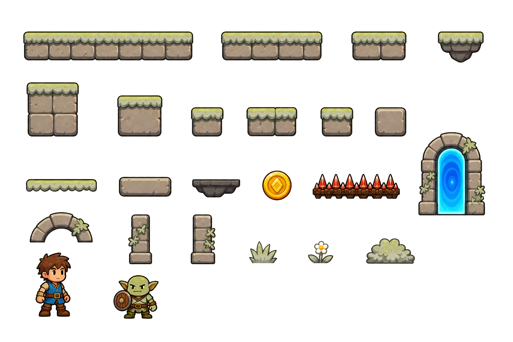
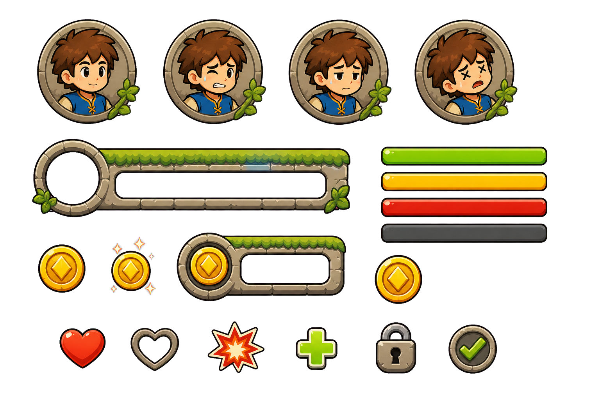

# Hero Quest: Public Asset Pack


*Gameplay: collect coins, avoid spikes, fight or dodge the purple orc, and
unlock the portal at the end of each level.*

Hero Quest is a bright fantasy platformer built from a single AI-generated
concept image. This public repo is the free companion resource pack: curated
runtime assets, manifests, and links from the video.

**Watch the full tutorial:** [Turning One Image Into a Playable iPhone Game -
Full Tutorial](https://www.youtube.com/watch?v=GstYJ-_ZBZo&utm_source=github&utm_medium=readme_header&utm_campaign=vgd09)

**Excalidraw Cheatsheet:** [Hero Quest platformer build cheatsheet](https://link.excalidraw.com/readonly/WwXubwX0nnIl7SagZkVV?darkMode=true&utm_source=github&utm_medium=readme_header&utm_campaign=vgd09)

> **Live demo:** [Play Hero Quest](https://aiod.dev/play-hero-quest?utm_source=github&utm_medium=readme_header&utm_campaign=vgd09)

## What You Get

This repo does **not** include the game source code. It is the public asset
pack that accompanies the video.

- **Runtime asset catalog** - `public/assets/index.json` records every curated
  asset, loader key, frame size, frame count, animation hint, config file, and
  authored level file.
- **Gameplay atlas** - `public/assets/tiles/quest/atlas-transparent.png` plus
  `atlas-transparent.manifest.json`.
- **UI atlas** - `public/assets/ui/quest/ui-atlas-transparent.png` plus
  `ui-atlas-transparent.manifest.json`.
- **Hero spritesheets** - `public/assets/hero-v2/` includes idle, walk, run,
  jump, punch, hurt, death, portal-entry, anchors, previews, and manifest.
- **Purple-orc spritesheets** - `public/assets/enemies/purple-orc/` includes
  idle, walk, run, jump, attack, hurt, death, anchor, previews, and manifest.
- **Parallax backgrounds** - `public/assets/backgrounds/quest-far.png`,
  `quest-mid.png`, and `quest-foreground.png`.
- **Audio** - `public/assets/audio/` includes the theme and gameplay SFX.
- **Config and level JSON** - `public/assets/config/` and
  `public/assets/levels/` show the data-driven runtime shape.

## Asset Previews






## Folder Map

```text
preview.gif
public/assets/
  index.json
  backgrounds/
  tiles/quest/
  ui/quest/
  hero-v2/
  enemies/purple-orc/
  audio/
  config/
  levels/
```

## Want The Full Build?

[](https://vibegamedev.com?utm_source=github&utm_medium=readme_footer&utm_campaign=vgd09)

This public repo is intentionally limited to free resources. The full
VibeGameDev member pack includes the complete source code and the development
workspace.

Brought to you by [VibeGameDev.com](https://vibegamedev.com?utm_source=github&utm_medium=readme_footer&utm_campaign=vgd09) - visit for more
AI game dev resources, starter projects, source code, prompts, and agent
workflows.

[VibeGameDev.com](https://vibegamedev.com?utm_source=github&utm_medium=readme_footer&utm_campaign=vgd09) members get:

- Complete Phaser source code.
- The tutorial `start` branch with hero/orc assets preloaded.
- Character, tile, background, playground, and level-editor systems.
- Selected prompts, plans, and learnings captured during development.
- Runtime assets, configs, authored levels, audio, UI, enemy behavior, iOS
  support, and polish systems in one place.

If you want to go beyond the free resource pack and study the full workflow,
join [VibeGameDev](https://vibegamedev.com?utm_source=github&utm_medium=readme_footer&utm_campaign=vgd09).
